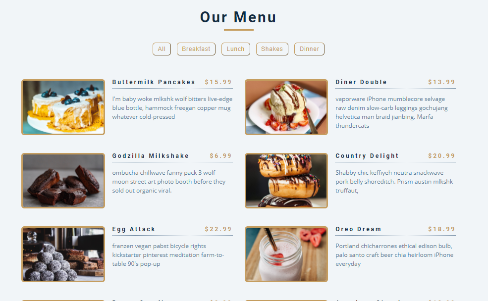
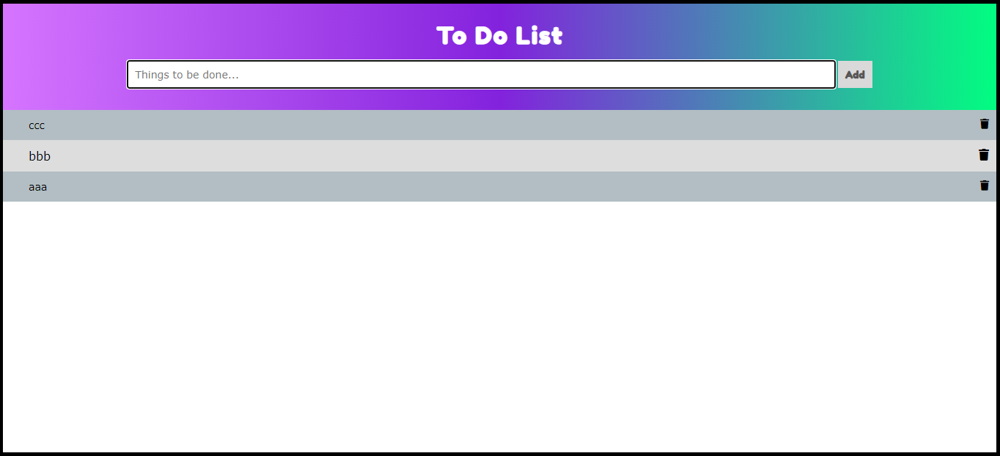
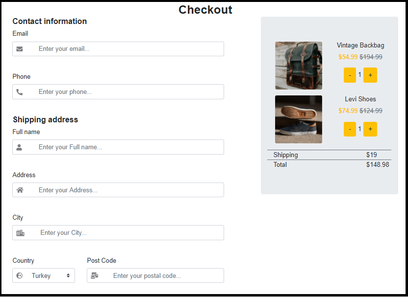

# Index

### Projects

- **Menu-List (HTML, CSS-Responsive, JS)**  [Repository](https://github.com/osmancbk/Menu-List) - 
  [Live demo](https://osmancbk.github.io/Menu-List/) 
      
- **To_Do_List (HTML, CSS-Responsive, JS)**  [Repository](https://github.com/osmancbk/To_Do-List) - 
  [Live demo](https://osmancbk.github.io/To_Do_List/) 
      
- **Calculator (HTML, CSS, JS)**  [Repository](#) - 
  [Live demo](#) 
      
- **Hangman_Game (HTML, CSS-Responsive, JS)**  [Repository](#) - 
  [Live demo](#) 
      
- **Website-Page-Design (HTML, SASS-Responsive, JS)**  [Repository](https://github.com/osmancbk/Website-Page-Design) - [Live demo](https://osmancbk.github.io/Website-Page-Design/) 
   
   
      
- **Find-Number (HTML, CSS-Responsive, JS)**  [Repository](https://osmancbk.github.io/Find-Number/) - 
  [Live demo](https://semihdurmus.github.io/JS_01_Find_the_Number/)  
      
- **My-Page-Work (HTML, CSS-Responsive)**  [Repository](https://github.com/osmancbk/My-Page-Work) - 
  [Live demo](https://osmancbk.github.io/My-Page-Work/)  
      
- **Sprint-1-Team-Member-Page (HTML, CSS-Responsive)**  [Repository](https://github.com/osmancbk/Sprint-1-Team-Member-Page) - 
  [Live demo](https://osmancbk.github.io/Sprint-1-Team-Member-Page/)  
      
- **parallaxSite (HTML, SASS-Responsive)**  [Repository](https://github.com/osmancbk/parallaxSite) - [Live demo](https://osmancbk.github.io/parallaxSite/) 
      
- **Checkout-Form (HTML, Bootstrap)**  [Repository](https://github.com/osmancbk/Checkout-Form/settings) - [Live demo](https://osmancbk.github.io/Checkout-Form/) 
      
- **Digital_Clock (HTML, CSS-Responsive, JS)**  [Repository](#) - 
  [Live demo](#)  
   
      
- **Google-Landing-Page (HTML, CSS)**  [Repository](https://github.com/osmancbk/Google-Landing-Page) - [Live demo](https://osmancbk.github.io/Google-Landing-Page/.) 
       
- **Hero-Page (HTML, SASS-Figma)**  [Repository](#) - [Live demo](#) 
      
- **Survey-Form-Netflix (HTML, CSS)**  [Repository](https://github.com/osmancbk/Survey-Form-Netflix) - 
  [Live demo](https://osmancbk.github.io/Survey-Form-Netflix/)  
      

   
